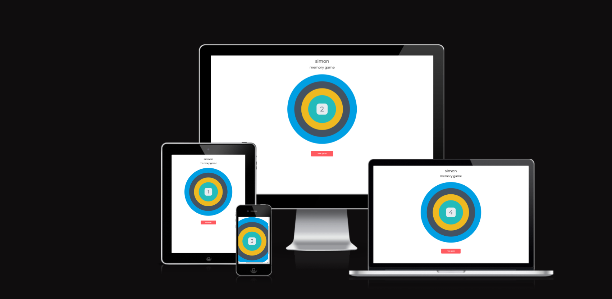

# Simon Memory Game 🧩 Powered by Test-Driven Awesomeness 🚀

▷ Welcome to the Simon Memory Game—a TDD-driven marvel straight from the Code Institute's playbook! Get ready for an epic memory showdown!

## What's the Quest?

▷ This game is the classic Simon Memory challenge, forged with TDD magic from the Code Institute's walkthrough. Your mission: repeat sequences of colors and sounds, each level a test of your memory mettle.

## Features to Level Up Your Experience 

● **TDD Mastery:** Crafted through the Code Institute's walkthrough, this game flexes its muscles with TDD wisdom.

● **Memory Training:** Challenge yourself with sequences that grow trickier by the level. Can you rise to the memory challenge?

● **Score Tracking:** Witness your scores soar as you conquer each sequence, leveling up like a memory hero.

● **Interactive Bliss:** : Lights, sounds, and interactive fun—all in this game to make your memory quest immersive.

## Ready to Embark on the Adventure?

1. **Setup Quest:** Clone the repository and gather the tools needed for this epic journey.
2. **Begin the Quest:** Fire up the game and embark on the memory adventure of a lifetime!
3. **Testing Grounds:** Peek into our tests, run them, and witness the reliability of the game's codebase.

## Tech Magic at Play ✨

● **JavaScript Sorcery:** The language behind the scenes, enchanting the game logic and features.

● **🧚‍♀️ Jest Spells:** Magic powered by Jest, ensuring the reliability and robustness of the game.

● **Stylish CSS Charms:** Crafted with finesse, weaving beautifully made styles.

● **HTML Magic Tales:** Building engaging stories, making the game experience awesome "easy to reach" for everyone.

## Forging the Game with Test-Driven Magic 🧙‍♂️

▷ This Simon Memory Game was crafted through the Test-Driven Development (TDD) approach, a process that shaped every aspect of its creation. Here's a glimpse into the journey:

### The TDD Journey

1. **Test-First Approach:** Each feature, from score tracking to sequence generation, began with a test. These tests captured expected behaviors and outcomes, serving as the guiding stars.

2. **Red-Green-Refactor Dance:** Following the TDD ritual, the initial tests would fail (Red), guiding the implementation of minimal code to pass the tests (Green). Subsequently, the code underwent refinement (Refactor) while ensuring the tests remained steadfast.

3. **Growing Confidence:** With every passing test suite, confidence in the game's reliability and functionality grew. The continuous cycle of testing, implementation, and refinement fortified its core.

### Testing Tools: The Arsenal of Reliability

▷ **Spells 🪄** Harnessing the powers of Jest, the testing framework, allowed for thorough examination of every function and feature. Assertions were cast, edge cases conquered, and the game's resilience assured.

### A Battle-Tested Game

▷ The Simon Memory Game stands as a testament to the prowess of Test-Driven Development. Each line of code, every button press, and each sound emitted has been rigorously tested and battle-hardened.

## The Sacred Scrolls of Licensing

▷ This project is enshrined under the MIT License, granting you the power to wield, modify, distribute, and enchant the world with it.

## Praises to the Wizards
▷ A massive shoutout to the Code Institute, the guiding wizards throughout this enchanting journey, and to all the resources that contributed to the creation of this epic Simon Memory Game quest.